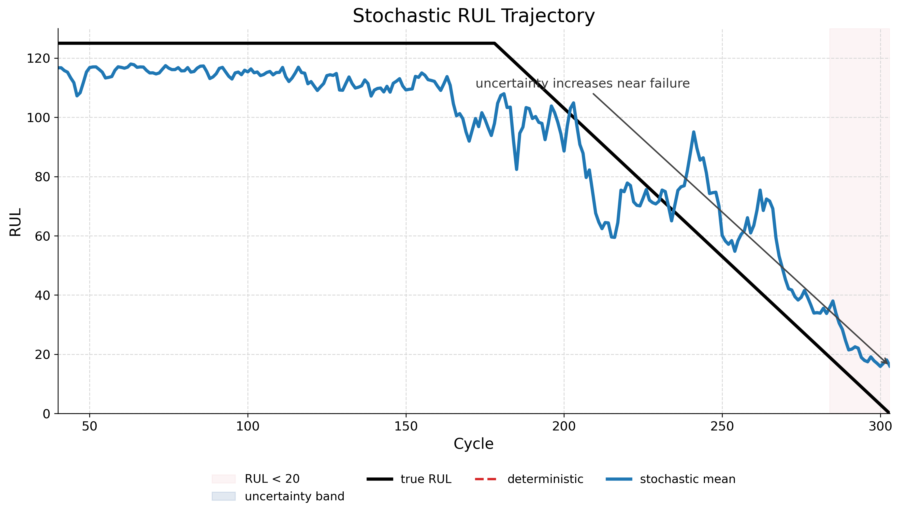
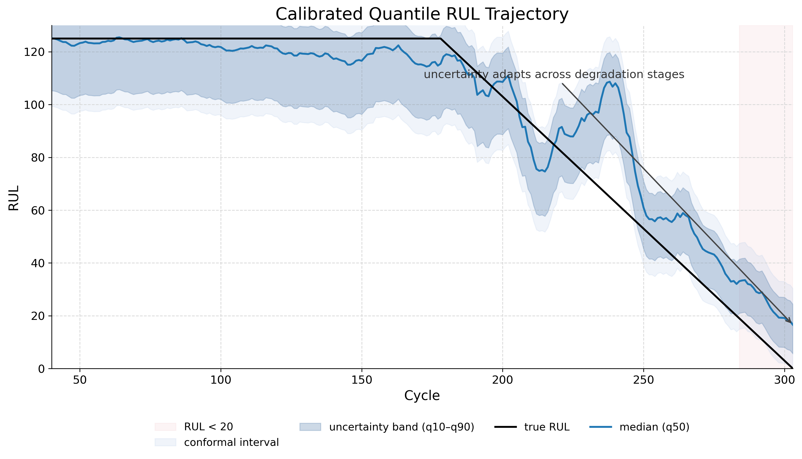
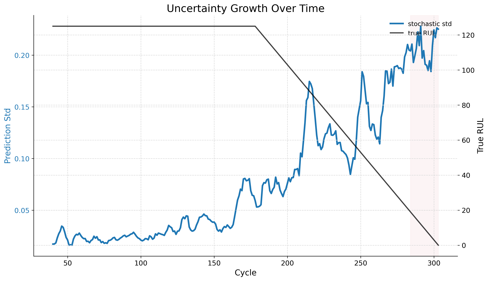
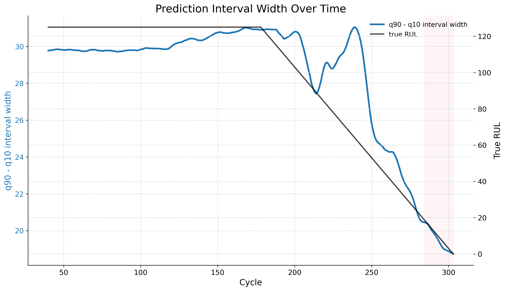
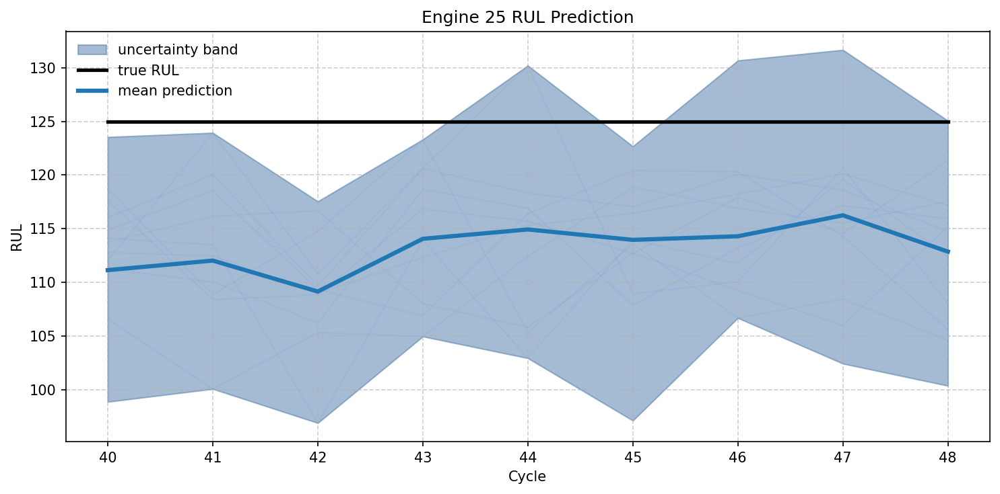
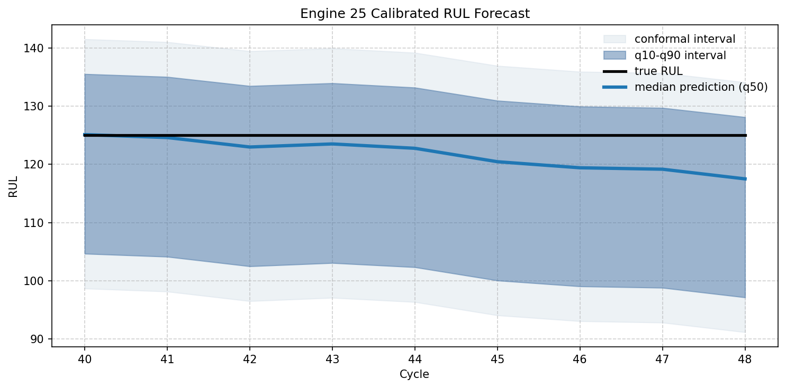
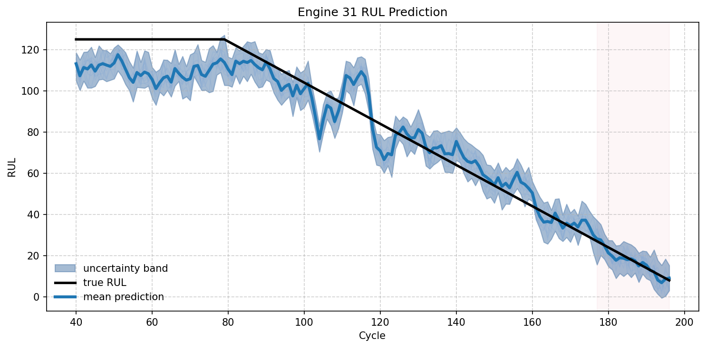
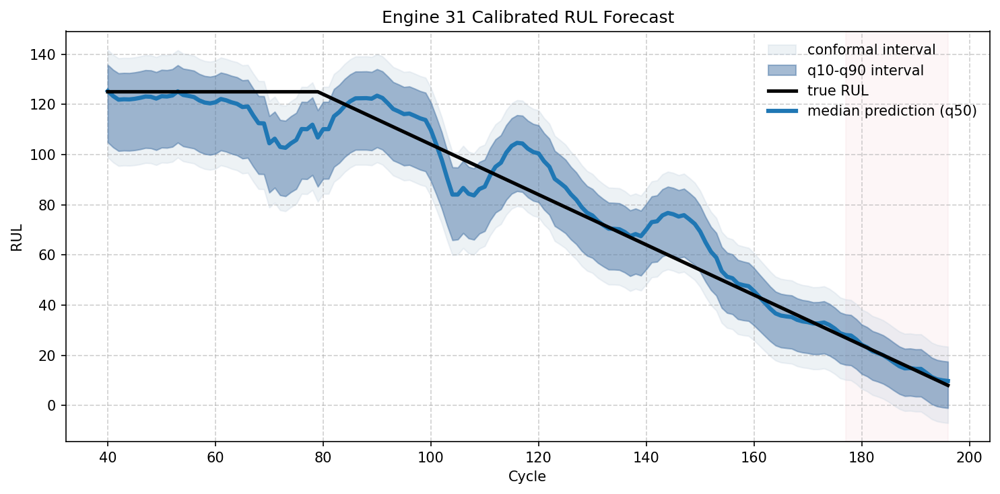
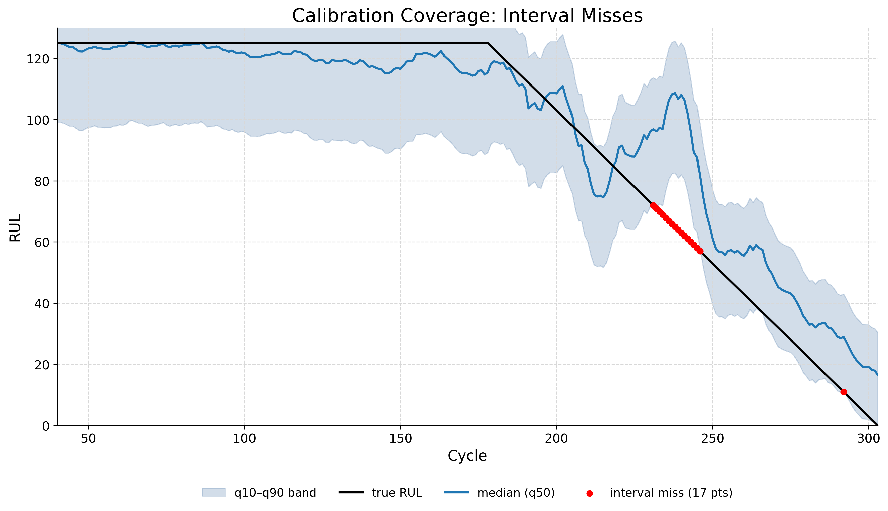

# Uncertainty-Aware RUL Prediction (C-MAPSS FD001)

## 1. Problem

Remaining Useful Life (RUL) models estimate how long equipment can keep operating before failure. Traditional deterministic models output a single point estimate per timestep. However, single-value predictions are insufficient, especially near degradation transitions where the risk of failure increases. In predictive maintenance, understanding uncertainty and the range of plausible future states is as critical as the expected outcome itself.

## 2. Evolution of the Project

The project evolved from exploratory stochastic sampling to a more grounded, calibrated probabilistic approach. 

### V1 — Stochastic Latent Sampling

Initially, we explored probabilistic forecasting through latent noise injection. By passing stochastic embeddings through the network, the model generated a spread of trajectory samples to represent uncertainty. While this highlighted regions of prediction difficulty, the resulting uncertainty was not properly calibrated. Much of the variance was induced by the design rather than purely learned, leading to unreliable coverage.

### V2 — Quantile Regression + Conformal Calibration

To address the limitations of heuristic noise, the system evolved into a formal probabilistic quantile forecasting approach. The current version predicts specific quantiles (q10, q50, q90) directly:
* **q50** represents the median (expected) prediction.
* **q10** and **q90** define a prediction interval intended to capture 80% of expected outcomes.

To ensure this interval is reliable, we apply **conformal calibration**. This post-processing step uses validation set statistics to correct the prediction intervals, ensuring the empirical coverage closely matches the target confidence level.

## 3. Architecture

The current system relies on:
* **Conv1D Encoder:** Extracts local temporal patterns from the multivariate sensor data.
* **LSTM Backbone:** Captures long-range temporal dependencies and degradation trends.
* **Quantile Prediction Head:** Outputs calibrated prediction intervals (q10, q50, q90) instead of single deterministic predictions.

## 4. Visual Comparison: V1 vs V2

V1 explored uncertainty heuristically using stochastic latent sampling. V2 transitioned to direct quantile forecasting combined with conformal calibration. This comparison shows the evolution from heuristic uncertainty to explicitly calibrated intervals.

| Feature | V1 (Stochastic Sampling) | V2 (Quantile Regression + Calibration) |
| ------- | ------------------------ | -------------------------------------- |
| **Trajectory** | <br> *Stochastic trajectory spread exposing prediction ambiguity.* | <br> *Calibrated q10-q90 intervals providing clear confidence bounds.* |
| **Uncertainty Growth** | <br> *Heuristic uncertainty induced through latent noise.* | <br> *Uncertainty adapting dynamically, peaking at degradation transitions.* |

## 5. Engine-Level Comparison: V1 vs V2

To see the direct impact of this evolution on individual predictions, we can compare the same test engines across both versions.

### Engine 25

| V1 — Stochastic Sampling | V2 — Calibrated Quantile Forecasting |
| ------------------------ | ------------------------------------ |
|  |  |

*V1 exposes uncertainty through stochastic trajectory spread, while V2 produces calibrated probabilistic intervals with a clearer confidence structure.*

### Engine 31

| V1 — Stochastic Sampling | V2 — Calibrated Quantile Forecasting |
| ------------------------ | ------------------------------------ |
|  |  |

*The noisy heuristic spread of V1 is replaced by V2's clearer q10-q90 boundaries, providing a more reliable signal for maintenance decisions.*

## 6. V2 Calibration Results

This section outlines the performance of V2 as the more mature system. While still not perfect, the calibration improves reliability significantly.



This plot shows the empirical coverage behavior after conformal calibration. The red points indicate interval misses. Most true values fall inside the calibrated intervals.

The calibrated intervals substantially improve reliability while maintaining reasonably narrow uncertainty bounds:

| Metric             | Value |
| ------------------ | ----- |
| RMSE               | 13.7  |
| MAE                | 9.4   |
| Coverage (q10–q90) | 0.88  |
| Quantile Crossing  | 0.00  |
| Avg Interval Width | 41.1  |

## 7. Key Insight

Transitioning from heuristic stochastic uncertainty to learned probabilistic forecasting demonstrates that uncertainty is not merely random noise. True predictive uncertainty should reflect the model's confidence and the inherent difficulty of the prediction at that specific time. Calibration matters just as much as point accuracy to inform maintenance safely.

## 8. Limitations / Future Work

* **Temporal Modeling:** The current architecture uses an LSTM, which has known limitations with very long-range dependencies. Exploring state-space models (e.g., Mamba) or transformers could improve long-horizon dynamics.
* **Architecture Extensions:** Further work could investigate multimodal extensions or richer probabilistic objectives to capture more complex predictive distributions.

## 9. How to Run

```bash
pip install -r requirements.txt
python scripts/evaluate.py
python scripts/plots.py
python scripts/demo_inference.py
```
