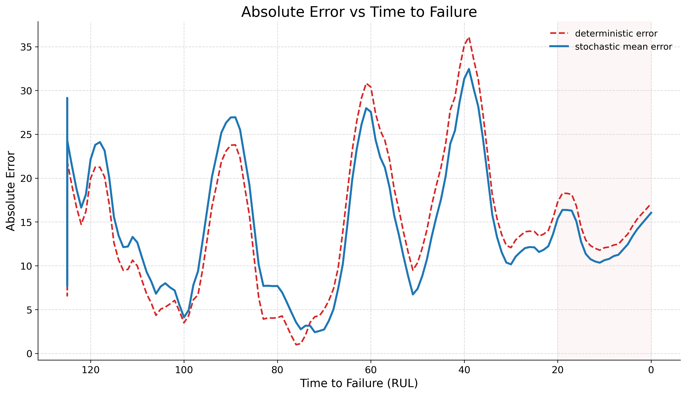
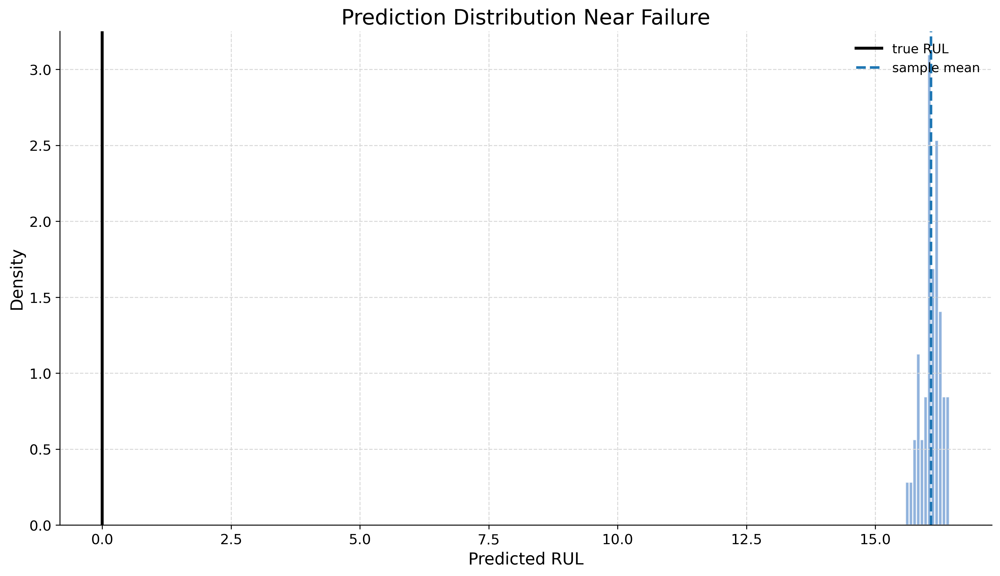

# Uncertainty-Aware RUL Prediction (C-MAPSS FD001)

## Problem

Remaining Useful Life (RUL) models are often used to estimate how long an engine can keep operating before failure. A standard deterministic model gives one prediction per timestep, but that single number hides uncertainty exactly where it matters most. Near failure, the risk is higher and multiple plausible predictions can arise, so we want predictions that reflect both expected RUL and confidence.

## Approach

- Dataset: NASA C-MAPSS FD001
- Input format: windowed multivariate time series with `T = 40`
- Feature encoder: Conv1D + LSTM backbone
- Baseline: deterministic RUL regression
- Extension: stochastic inference through noise sampling in latent space
- Output: multiple sampled trajectories instead of a single point estimate

## Key Results

- `RMSE_baseline ≈ 14.7`
- `RMSE_stochastic ≈ 15.5`
- `~5%` RMSE tradeoff for uncertainty-aware predictions
- Stochastic spread increases near failure

The stochastic model provides a spread of predictions rather than a single point estimate. However, this uncertainty is not fully calibrated. There is an inherent tradeoff: the model accepts a slightly worse RMSE in exchange for a richer output that quantifies prediction variance as degradation accelerates.

## Visual Results

### Trajectory with Uncertainty


The model tracks general degradation trends, but shows bias near failure. The trajectory spread grows as failure approaches, though this increase is partly due to model design rather than purely learned behavior.

### Uncertainty Growth


Prediction uncertainty rises as the engine gets closer to failure. While this aligns with the late-life regime, the prediction distribution near failure may not always include the true value, indicating some overconfidence.

### Error vs Time-to-Failure



Prediction error also tends to increase near failure. The model's difficulty in this regime reinforces why exposing uncertainty is critical, even when that uncertainty is not yet perfectly aligned with true error.

### Prediction Distribution



Multiple stochastic runs produce a spread of RUL predictions. This spread exposes variability in predictions near failure, though it does not yet represent a calibrated set of plausible outcomes.

## Key Insight

Deterministic models collapse uncertainty into a single estimate, even when the future is ambiguous. This stochastic extension exposes multiple plausible outcomes, allowing for a better assessment of risk. However, current uncertainty estimates are not calibrated and may fail to reliably capture the true error near critical failure regimes. In particular, the model can be confidently wrong near failure, highlighting a gap between predictive variance and true uncertainty.

## Limitations / Future Work

- **Calibration Issues**: The model tends to overestimate RUL near failure. Uncertainty is driven partly by heuristic noise scaling, and the predictive distribution does not reliably capture the true error.
- **Improved Training**: Use likelihood-based or quantile-based training (e.g., Negative Log Likelihood or Pinball Loss) to align uncertainty estimates with actual predictive error.
- **Architecture**: The current backbone uses an LSTM, which struggles with long-range temporal dependencies. Replacing it with a state-space model (e.g., Mamba) is expected to better capture long-horizon dynamics and improve late-stage prediction behavior.
- **Advanced Distribution Learning**: The current stochastic approach uses simple noise injection. Extending this to a flow-matching objective is expected to enable learning a richer conditional distribution over future states.

## How to Run

```bash
pip install -r requirements.txt
python scripts/evaluate.py
python scripts/plots.py
```
